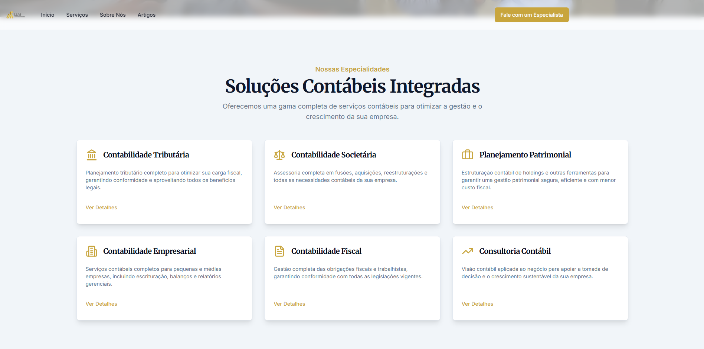
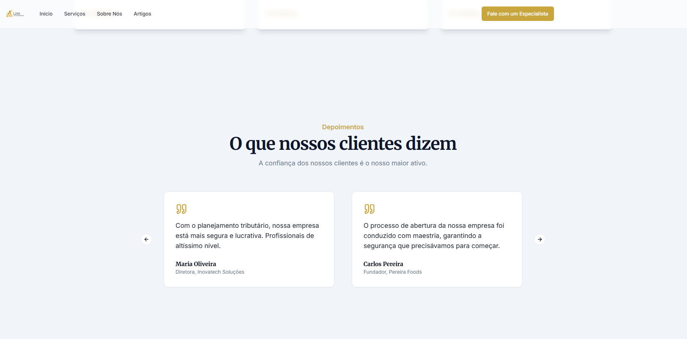
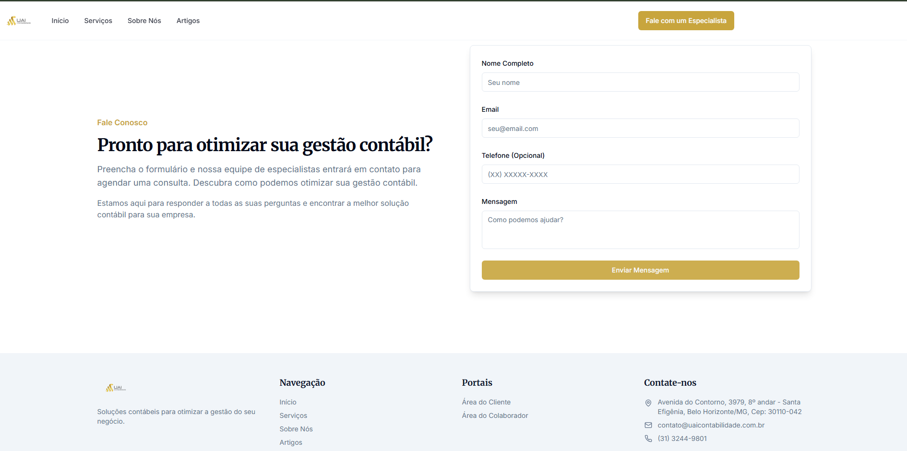

# 💼 UAI Contabilidade — Landing Page Profissional

  
  
  
  
  
  
  

  <h3>✨ Soluções Contábeis Integradas para o Sucesso do Seu Negócio ✨</h3>
  
<strong>Landing page moderna e responsiva para captação de clientes</strong>

---

## 🧭 Visão Geral

Landing page moderna e responsiva desenvolvida para destacar os serviços da **UAI Contabilidade**, com foco em conversão, clareza e credibilidade. O projeto apresenta uma interface limpa e estratégica para captação de clientes e apresentação institucional.

A página foi projetada com base em boas práticas de UX/UI e comunicação corporativa para o setor contábil. O visitante encontra rapidamente as soluções oferecidas, depoimentos reais e um canal direto de contato com especialistas.

---

## 📸 Screenshots da Landing Page

### 🏠 Seção Inicial (Hero)

*Headline impactante com call-to-action direto*

### 🧾 Soluções Contábeis Integradas  

*Apresentação dos 6 principais serviços oferecidos*

### 💬 Depoimentos de Clientes

*Prova social com comentários de clientes satisfeitos*

### 📞 Fale Conosco

*Formulário funcional para captação de leads*

---

## 💡 Estrutura de Conteúdo

### 1. 🏠 Hero Section
- **Headline:** "Contabilidade Estratégica para o Sucesso do Seu Negócio"
- **Subtítulo:** "Soluções contábeis e de gestão que impulsionam o crescimento e a saúde financeira da sua empresa."
- **Botões de ação:** Fale com um Especialista e Nossos Serviços

### 2. 🧾 Soluções Contábeis Integradas
Seção que apresenta os principais serviços oferecidos pela UAI Contabilidade:

- **Contabilidade Tributária** — Planejamento fiscal e otimização de carga tributária
- **Contabilidade Societária** — Fusões, aquisições e reestruturações empresariais
- **Planejamento Patrimonial** — Estruturação de holdings e gestão segura de patrimônio
- **Contabilidade Empresarial** — Escrituração, balanços e relatórios gerenciais
- **Contabilidade Fiscal** — Gestão completa de obrigações fiscais e trabalhistas
- **Consultoria Contábil** — Apoio estratégico à tomada de decisão

### 3. 💬 Depoimentos de Clientes
Prova social com comentários de clientes satisfeitos, reforçando confiança e credibilidade:

> *"Com o planejamento tributário, nossa empresa está mais segura e lucrativa. Profissionais de altíssimo nível."*  
> **— Maria Oliveira, Diretora - Inovatech Soluções**

> *"O processo de abertura da nossa empresa foi conduzido com maestria, garantindo a segurança que precisávamos para começar."*  
> **— Carlos Pereira, Fundador - Pereira Foods**

### 4. 📞 Fale Conosco
Formulário funcional para captação de leads e atendimento personalizado:

**Campos do formulário:**
- Nome completo
- E-mail
- Telefone (opcional)
- Mensagem

**Informações de contato:**
- Endereço completo
- E-mail e telefone do escritório
- Links para áreas do cliente e colaborador

---

## 🛠️ Tecnologias Utilizadas

### Frontend
- **HTML5** — Estrutura semântica e otimizada para SEO
- **CSS3** — Design responsivo, tipografia clara e tons corporativos
- **JavaScript (Vanilla)** — Interatividade leve e funcional
- **Design Responsivo** — Adaptável para desktop, tablet e mobile

### Integração com Ferramentas e Ecossistema Cloud

A landing page foi desenvolvida com foco em integração e escalabilidade, seguindo as melhores práticas de desenvolvimento moderno:

#### 🔗 **Frameworks e Ferramentas Complementares**
- **OPA (Open Policy Agent)** — Estrutura de políticas para validação de formulários e dados
- **Gatekeeper** — Sistema de validação de entrada de dados do usuário
- **ArgoCD e FluxCD** — Deploy contínuo e versionamento automático
- **Prometheus / Grafana** — Monitoramento de performance e métricas de conversão

#### 📊 **Frameworks de Compliance e Segurança**
- **CIS Benchmarks** — Padrões de segurança implementados no desenvolvimento
- **NIST** — Framework de compliance para proteção de dados sensíveis
- **LGPD** — Conformidade com a Lei Geral de Proteção de Dados brasileira
- **ISO 27001** — Padrões de segurança da informação aplicados

---

## 🏗️ Arquitetura e Integração

### 🔄 **Pipeline de Deploy Contínuo**
- **ArgoCD** — GitOps para deploy automático da landing page
- **FluxCD** — Sincronização contínua com repositório Git
- **CI/CD** — Integração contínua para testes e validação

### 📈 **Monitoramento e Observabilidade**
- **Prometheus** — Coleta de métricas de performance e conversão
- **Grafana** — Dashboards para análise de dados e KPIs
- **Alertas** — Notificações automáticas para problemas de performance

### 🔒 **Segurança e Compliance**
- **OPA Policies** — Validação automática de formulários e dados
- **Gatekeeper** — Controle de acesso e validação de entrada
- **CIS Benchmarks** — Implementação de padrões de segurança
- **NIST Framework** — Estrutura de segurança para dados sensíveis

### 🌐 **Ecosistema Cloud-Native**
- **Containerização** — Deploy em ambientes containerizados
- **Microserviços** — Arquitetura modular e escalável
- **API Gateway** — Gerenciamento de integrações externas
- **Service Mesh** — Comunicação segura entre serviços

---

## 🎯 Objetivos da Landing Page

### ✅ Conversão
- Formulário de contato estratégico para captação de leads
- Call-to-actions claros e diretos
- Prova social com depoimentos reais

### ✅ Credibilidade
- Design profissional e moderno
- Informações de contato completas
- Especialidades bem definidas

### ✅ Usabilidade
- Navegação intuitiva
- Layout limpo e organizado
- Responsividade em todos os dispositivos

---

## 📬 Contato

**UAI Contabilidade**
- 📍 **Endereço:** Avenida do Contorno, 3979, 8º andar — Santa Efigênia, Belo Horizonte/MG, CEP: 30110-042
- 📧 **E-mail:** contato@uaicontabilidade.com.br
- 📞 **Telefone:** (31) 3244-9801

---

## 📄 Licença

Este projeto é distribuído sob a licença MIT.  
Você pode utilizá-lo, modificá-lo e incluí-lo livremente no seu portfólio.

---

  
<strong>Desenvolvido com ❤️ para demonstrar profissionalismo, credibilidade e inovação em contabilidade</strong>

  
✨ Soluções contábeis para otimizar a gestão do seu negócio ✨

